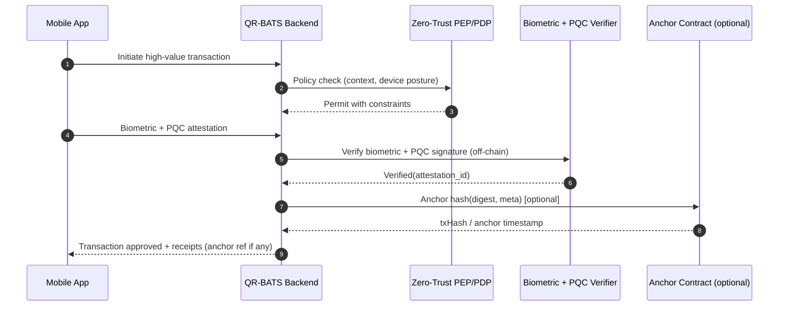

# Smart Contracts

## Overview

The current design of the QR-BATS system, as detailed in the project documentation, does not incorporate blockchain elements or smart contracts. The solution focuses on leveraging Post-Quantum Cryptography (PQC), advanced biometrics, and a Zero-Trust Architecture for securing high-value digital banking transactions within a centralized banking system.

## Future Considerations

While smart contracts are not part of the initial implementation, future enhancements could explore the integration of blockchain technology for specific use cases, such as:

- Immutable Transaction Logs: Using a distributed ledger to maintain an unchangeable record of high-value transactions for enhanced auditability and transparency.
- Decentralized Identity Management: Exploring blockchain-based identity solutions to complement or enhance the existing biometric and FIDO-based identity verification.
- Automated Policy Enforcement: Implementing certain Zero-Trust policies as smart contracts for automated and transparent enforcement across a consortium of financial institutions.

Any such integration would require careful consideration of scalability, regulatory compliance, and the specific benefits it would bring to the QR-BATS system.

## Why (and When) To Consider Smart Contracts

- Regulatory-grade audit trails (append-only, tamper-evident) across multiple institutions.
- Multi-party workflows (e.g., >1 bank approval) that benefit from deterministic, shared state.
- External audit anchoring to public chains for proof-of-existence without disclosing PII.

If these needs are not present or are met by existing systems, QR-BATS should remain centralized.

## Candidate Architecture Paths

1. Proof-of-Existence Anchoring (near-term)
   - Verify biometrics and PQC signatures off-chain.
   - Anchor only a salted hash of the transaction record to a ledger for audit.
   - Zero PII on-chain.

2. Consortium Permissioned Ledger (mid-term)
   - Share immutable logs among partner banks/regulators.
   - Smart contracts define minimal workflow rules and retention policies.

3. Policy-as-Code On-Chain (long-term)
   - Select Zero-Trust rules eligible for deterministic enforcement.
   - Keep sensitive evaluation (risk, biometrics) off-chain; post attestations/proofs only.

## Platform Options (Permissioned-first)

| Platform                  | Model                    | Strengths                                       | Notes/Constraints                                  |
|---------------------------|--------------------------|-------------------------------------------------|----------------------------------------------------|
| Hyperledger Fabric        | Permissioned, chaincode  | High throughput, channels, private data         | Operational complexity, Go/Java/Node chaincode     |
| Quorum / Hyperledger Besu | Permissioned EVM         | Ethereum tooling, private transactions, events  | secp256k1 keys; PQC not native                     |
| R3 Corda                  | Point-to-point DLT       | Strong privacy, legal entity focus              | Not a blockchain; contract flows over UTXO states  |
| Hyperledger Indy/Aries    | DID/VC identity          | Standards-based decentralized identity          | Complementary to identity, not general ledger      |

Note on PQC: Most ledgers use ECDSA/EdDSA today. You can still use PQC off-chain and anchor PQC-verified results on-chain via hashes or proofs.

## Data Model (Anchoring Example)

Only anchor non-sensitive digests; keep PII and full records off-chain.

```json
{
  "transaction_id": "uuid",
  "digest_alg": "SHA-256",
  "digest": "hex_sha256_of_canonical_record_plus_salt",
  "pqc_alg": "CRYSTALS-Dilithium3",
  "attestation_id": "uuid",
  "timestamp": "2025-01-15T12:34:56Z",
  "metadata": {
    "version": "1.0",
    "schema": "qr-bats/tx-attestation"
  }
}
```

Recommended: Use an HMAC (bank-held secret) or per-record random salt to prevent dictionary attacks on anchored hashes.

## Minimal Anchor Contract (Example: Solidity, EVM-compatible)

```solidity
// SPDX-License-Identifier: MIT
pragma solidity ^0.8.19;

/// @title Proof-of-Existence Anchor for QR-BATS
contract QRBatsAnchor {
    event Anchored(bytes32 indexed digest, address indexed registrar, uint256 timestamp, string meta);

    mapping(bytes32 => uint256) public anchoredAt;

    function anchor(bytes32 digest, string calldata meta) external {
        require(digest != bytes32(0), "invalid digest");
        require(anchoredAt[digest] == 0, "already anchored");
        anchoredAt[digest] = block.timestamp;
        emit Anchored(digest, msg.sender, block.timestamp, meta);
    }

    function isAnchored(bytes32 digest) external view returns (bool, uint256) {
        uint256 ts = anchoredAt[digest];
        return (ts != 0, ts);
    }
}
```

- Store only a fixed-size digest (no PII).
- Off-chain systems maintain the mapping between digest and full record.

## Integration Flow (Anchoring)



## Security, Privacy, and Compliance

- Data minimization: Never place PII, biometrics, or raw transaction data on-chain. Anchor only salted digests and metadata needed for audit.
- PQC readiness: Perform PQC verification off-chain; store PQC algorithm and attestation references alongside the anchored digest.
- Right-to-erasure: Anchoring salted/HMACed digests avoids anchoring directly reversible personal data.
- Finality and SLAs: Choose platforms with predictable finality (e.g., Fabric endorsement + ordering; Quorum IBFT). Document RTO/RPO implications.
- Key management: Use HSM/KMS (e.g., AWS KMS, HashiCorp Vault) for contract admin keys and ledger client keys.
- Monitoring: Emit events and export to SIEM; reconcile anchors with off-chain logs via scheduled jobs.

## Decision Criteria Checklist

- Does a shared, tamper-evident log across parties materially reduce fraud/audit cost?
- Can all sensitive computations remain off-chain without reducing assurance?
- Are latency and throughput targets compatible with ledger finality?
- Is regulatory approval feasible for targeted jurisdictions?

## Non-Goals (for now)

- Storing PII/biometrics on-chain.
- On-chain PQC verification.
- Replacing core banking settlement with tokenized assets.
